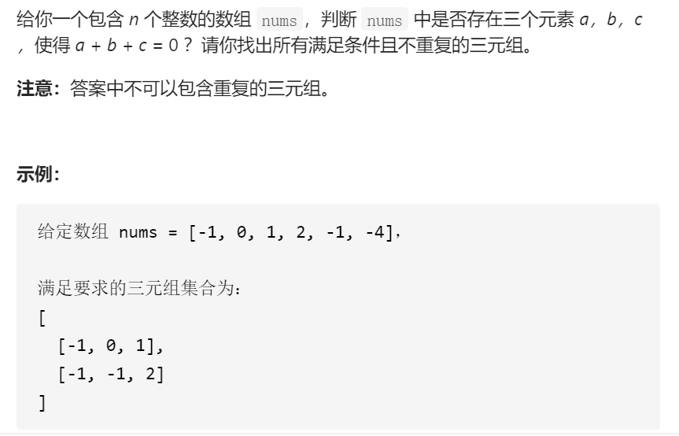
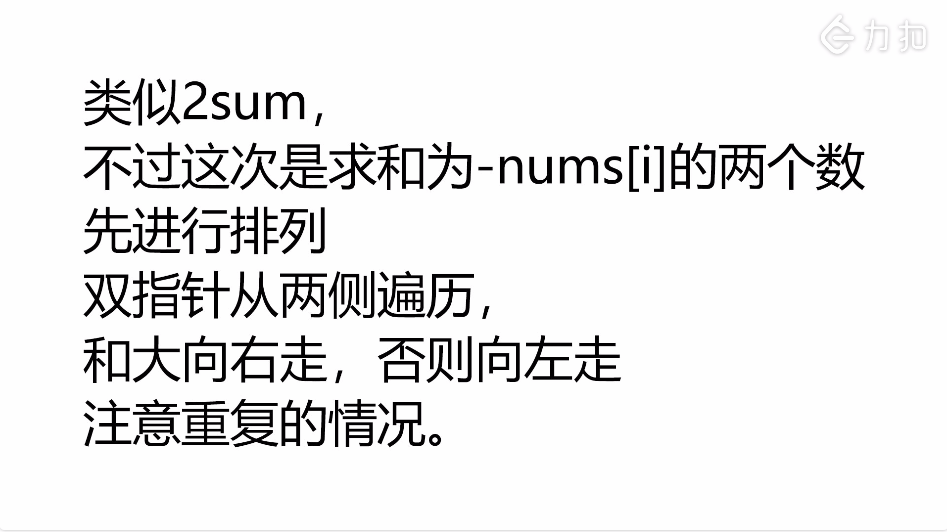
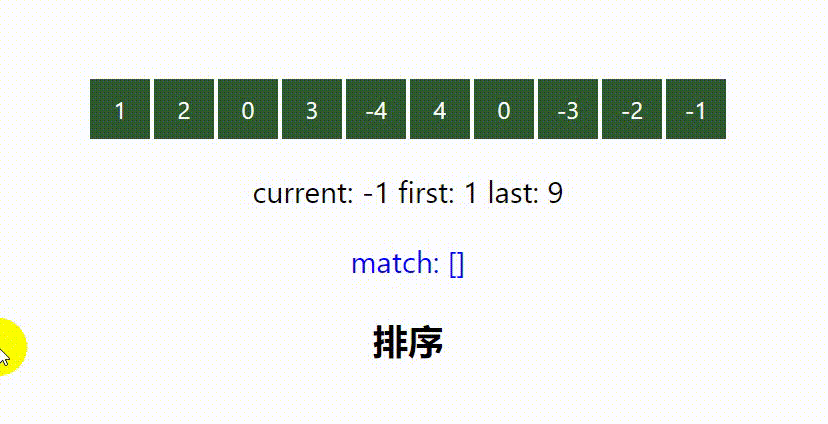

# 三数之和

### 问题描述




### 思路分析

- #### 先排序

- #### 再使用双指针，计算两个指针所指向的数字和，是大于当前元素，还是小于当前元素，如若大于当前元素，则右指针左移，否则左指针右移。







### 哈希解法

两层for循环就可以确定 a 和b 的数值了，可以使用哈希法来确定 0-(a+b) 是否在 数组里出现过，其实这个思路是正确的，但是我们有一个非常棘手的问题，就是题目中说的不可以包含重复的三元组。

把符合条件的三元组放进vector中，然后在去去重，这样是非常费时的，很容易超时，也是这道题目通过率如此之低的根源所在。

去重的过程不好处理，有很多小细节，如果在面试中很难想到位。

时间复杂度：O(n^2)，但是运行时间很长，不好做剪枝操作

### 代码

```
class Solution
{
public:
    vector<vector<int>> threeSum(vector<int> &nums) {
        vector<vector<int>> result;
        int vecSize = int(nums.size());
        if (vecSize <= 2) { return result; }

        int possibleSize = vecSize - 2;
        sort(nums.begin(), nums.end());

        for (int index = 0; index < possibleSize; index++)
        {
            int intNow = nums[index];
            if(intNow > 0){ break;  }
            int negativeNow = 0 - intNow;
            int lo = index + 1;
            int hi = vecSize - 1;

            while (lo < hi) {
                int intLo = nums[lo];
                int intHi = nums[hi];

                if (intLo + intHi == negativeNow)
                {
                    vector<int> tmpVec{intNow, intLo, intHi};
                    result.push_back(tmpVec);
                    //去重
                    while (lo < hi && nums[lo] == intLo) { lo++; }
                    while (lo < hi && nums[hi] == intHi) { hi--; }
                }
                else if (intLo + intHi < negativeNow) {
                    lo++;
                }
                else if (intLo + intHi > negativeNow) {
                    hi--;
                }
            }
            //去重
            while (index + 1 < possibleSize && nums[index] == nums[index + 1]) {
                index++;
            }
        }

        return result;
    }
};

```

