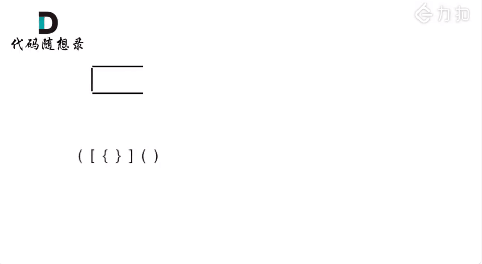

### 问题描述


### 思路分析

* **算法原理**
  * 栈先入后出特点恰好与本题括号排序特点一致，即若遇到左括号入栈，遇到右括号时将对应栈顶左括号出栈，则遍历完所有括号后 stack 仍然为空；
* **算法流程**
  * 如果 c 是左括号，则入栈 ；
  * 如果 c 是右括号，则从栈中取顶元素（取之前要确保栈非空，为空则返回false），若跟 c 是一对，则弹出栈顶元素，否则，返回false。
  * 最后判断栈是否为空，为空则表示有效，否则无效

* **复杂度分析**
  * 时间复杂度 O(N)*O*(*N*)：正确的括号组合需要遍历 11 遍 `s`；
  * 空间复杂度 O(N)*O*(*N*)：哈希表和栈使用线性的空间大小。

### 动画


### 代码

```C++
public:
    bool isValid(string s) {
        stack<char> st;
        for (char c : s) {
            if (c == '(')           st.push('(');
            else if (c == '{')      st.push('{');
            else if (c == '[')      st.push('[');
            // st.top() 的前提是 !st.empty()
            else if (c == ')' && !st.empty() && st.top() == '(') st.pop();
            else if (c == '}' && !st.empty() && st.top() == '{') st.pop();
            else if (c == ']' && !st.empty() && st.top() == '[') st.pop();
            else return false;    
        }
        return st.empty();
    }
};
```


### 方法二

由于栈结构的特殊性，非常适合做对称匹配类的题目。首先我们要弄清楚，字符串里的括号不匹配有几种情况。

一些同学，在面试中看到这种题目上来就开始写代码，建议要写代码之前要分析好有哪几种不匹配的情况，如果不动手之前分析好，写出的代码也会有很多问题。 会给面试官留下不好的印象。

我们先来分析一下 这里有三种不匹配的情况，

第一种情况，字符串里左方向的括号多余了 ，所以不匹配。


第二种情况，括号没有多余，但是 括号的类型没有匹配上。


第三种情况，字符串里右方向的括号多余了，所以不匹配。


我们的代码只要覆盖了这三种不匹配的情况，基本就不会出问题，可以看出 动手之前分析好题目的重要性。



### 代码

```C++
class Solution {
public:
    bool isValid(string s) {
        stack<int> st;
        for (char c : s) {
            if (c == '(') 		st.push(')');
            else if (c == '{') 	st.push('}');
            else if (c == '[') 	st.push(']');
            else if (st.empty() || st.top() != c) return false;
            else st.pop(); 		// st.top() == c
        }
        return st.empty();
    }
};
```

