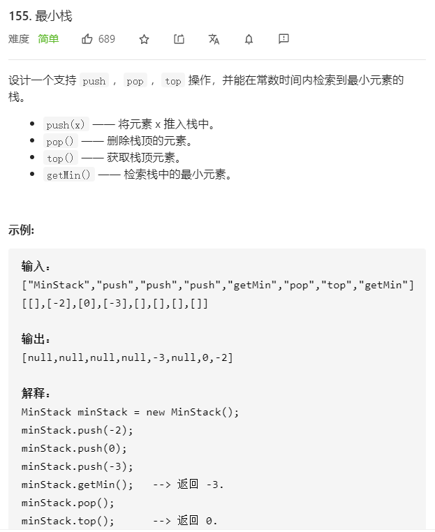

### 问题描述



### 解题思路

要做出这道题目，首先要理解栈结构先进后出的性质。

对于栈来说，如果一个元素 a 在入栈时，栈里有其它的元素 b, c, d，那么无论这个栈在之后经历了什么操作，只要 a 在栈中，b, c, d 就一定在栈中，因为在 a 被弹出之前，b, c, d 不会被弹出。

因此，在操作过程中的任意一个时刻，只要栈顶的元素是 a，那么我们就可以确定栈里面现在的元素一定是 a, b, c, d。

那么，我们可以在每个元素 a 入栈时把当前栈的最小值 m 存储起来。在这之后无论何时，如果栈顶元素是 a，我们就可以直接返回存储的最小值 m。


按照上面的思路，我们只需要设计一个数据结构，使得每个元素 a 与其相应的最小值 m 时刻保持一一对应。因此我们可以使用一个辅助栈，与元素栈同步插入与删除，用于存储与每个元素对应的最小值。

当一个元素要入栈时，我们取当前辅助栈的栈顶存储的最小值，与当前元素比较得出最小值，将这个最小值插入辅助栈中；

当一个元素要出栈时，我们把辅助栈的栈顶元素也一并弹出；

在任意一个时刻，栈内元素的最小值就存储在辅助栈的栈顶元素中。

### 代码

```C++
class MinStack {
public:
    /** initialize your data structure here. */
    MinStack() {
        minSk.push(INT_MAX);
    }
    
    void push(int x) {
        sk.push(x);

        if (x < minSk.top()) minSk.push(x);
        else minSk.push(minSk.top());
    }
    
    void pop() {
        sk.pop();
        minSk.pop();
    }
    
    int top() {
        return sk.top();
    }
    
    int getMin() {
        return minSk.top();
    }

private:
    stack<int> sk;
    stack<int> minSk;
};
```

